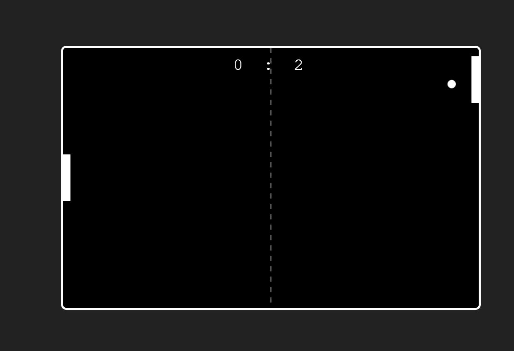

# Pong Game



A simple **Pong game** created using **HTML, CSS, and JavaScript**. This classic arcade game allows two players to compete by controlling paddles and bouncing the ball back and forth.

---

## Table of Contents

- [Demo](#demo)
- [Features](#features)
- [Technologies Used](#technologies-used)
- [Installation](#installation)
- [How to Play](#how-to-play)
- [Contributing](#contributing)
- [License](#license)

---

## Demo

Check out the game demo above to see the gameplay in action.

---

## Features

- Two-player gameplay (left and right paddles)
- Score tracking
- Smooth ball movement with collision detection
- Responsive design for desktop

---

## Technologies Used

- **HTML**: Structure of the game
- **CSS**: Styling and layout
- **JavaScript**: Game logic and interaction

---

## Installation

To run the game locally:

1. Clone the repository:
   ```bash
   git clone https://github.com/imranmalakzai/pong-game.git
   Open index.html in your browser.
   ```

Start playing!

How to Play
Player 1 (Left Paddle): Use W (up) and S (down) keys.

Player 2 (Right Paddle): Use Arrow Up and Arrow Down keys.

The first player to reach the maximum score wins the game.

Contributing
Contributions are welcome! To contribute:

Fork the repository

Create a new branch:

bash
Copy code
git checkout -b feature-name
Make your changes

Commit your changes:

bash
Copy code
git commit -m "Add feature"
Push to the branch:

bash
Copy code
git push origin feature-name
Open a Pull Request
